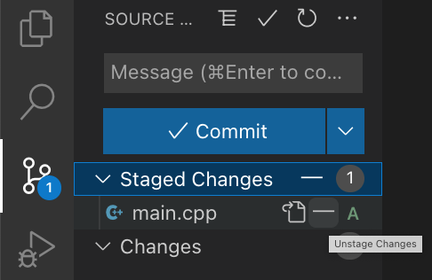

# Clases prácticas del curso de Introducción a GIT

En estas clases, vamos a seguir unos talleres para afianzar los conocimientos adquiridos en la parte teórica del curso. 

Tabla de contenidos

* [Requisitos](#requisitos)
* [Taller 1 - Acciones básicas](#taller-1)
* [Taller 2 - Creación de ramas](#taller-2)
* [Taller 3 - Deshacer cambios ](#taller-3)
* [Taller 4 - Gestión de conflictos](#taller-4)
* [Taller 5 - Ignorar ficheros](#taller-5)
* [Taller 6 - Guardar ficheros temporalmente](#taller-6)
* [Taller 7 - Etiquetas](#taller-7)

* [Git Lens](#gitlens)
* [Buenas prácticas](#buenas-practicas)
* [Resumen de comandos](comandos.md)

## Requisitos:
- Conocimientos teóricos de GIT.
- Un ordenador con GIT instalado.
- Por comodidad se puede disponer de un entorno de desarrollo instalado. Por ejemplo, Visual Studio Code o IntelliJ Idea.
- Conocimiento de CLI (en inglés, command line interface, o interfaz línea de comandos). Los comandos utilizados aunque serán pocos serán sobre todo comandos de UNIX.
- Motivación y ganas de aprender. :smile:

## Taller 1 - Acciones básicas

En este taller vamos a crear un repositorio, le añadiremos un archivo y guardaremos los cambios de manera permanente en nuestro proyecto. Después de cada paso es aconsejable ejecutar `git status` para ver el estado de nuestro repositorio y de los archivos que lo conforman. También es aconsejable usar `git log --oneline -5` para ver los últimos 5 cambios referidos a ramas e identificadores de commit.

Comenzamos con el taller:

1. Creamos una carpeta y nos colocamos en ella. Ejecutamos `mkdir taller-1`. Este comando es de UNIX. En Windows puede crearse con `md taller-1` o simplemente desde el explorador de archivos.

1. Damos a la carpeta características de un proyecto git. Ejecutamos `git init`. Se habrá creado la carpeta oculta `.git`. 

1. Dependiendo de la versión que usemos y de la configuración, quizá nos pida crear la rama principal del proyecto. En el caso de tener que crearla usaremos `git branch -m master` y se habrá creado la rama `master` del proyecto. En la parte inferior izquierda de VS Code podemos ver algo como lo siguiente:

    

1. Creamos archivos para el proyecto, por ejemplo `main.cpp` y lo modificamos con el código adecuado. Vemos que el fichero está marcado con una U (Untracked) con lo cual sabemos que está ahí pero no está gestionado por git.

    

1. Para que esté gestionado por git, los ficheros deben añadirse desde el área de trabajo al área preparación. Para ello ejecutamos `git add main.cpp` o presionamos el icono :heavy_plus_sign: 

    

1. Ahora el fichero está marcado con una A (Added). Ello nos indica que está listo para ser incluido en nuestro próximo commit.

    

1. Si nos arrepentimos y queremos que no se incluya, será tan secillo como ejecutar `git rm --cached main.cpp` o presionar el icono icono :heavy_minus_sign: en el interfaz de usuario.

    

1. El fichero vuelve a estar como en el paso anterior listo para ser añadido o descartado de nuevo.

    

1. Una situación curiosa es cuando tenemos el fichero añadido y lo modificamos después.

    

    En este momento, si hacemos `commit` sólo se añadirán los cambios del área preparación. Si los queremos todos habrá que añadir de nuevo el fichero con `git add` y hacer el commit tras este paso.

1. Descartamos los cambios últimos haciendo click en el icono :heavy_minus_sign: de la subárea de cambios ('Changes'). No hay que confundirla con el área preparación ('Staged Changes')

1. Llegados a este punto estamos listos para hacer nuestros cambios permanentes. Necesitamos hacer un commit. Para ello ejecutamos `git commit -m "Versión inicial"`. El parámetro `-m` sirve para especificar un mensaje. Este deberá ser obligatorio y descriptivo de los cambios que se incluyen en el commit.

    Si usamos la interfaz gráfica de usuario debemos pulsar el botón 'Commit' o alguna de sus variantes.

    

    Se abrirá una ventana y allí especificaremos el mensaje.

    

    Escribimos el mensaje y pulsamos el icono de aceptar :heavy_check_mark:

1. Una vez que nuestros archivos en local están correctos tenemos que compartirlos. Para ello, los subimos al repositorio remoto de GitHub. Primero creamos un repositorio en GitHub. La manera recomendada de hacerlo es hacer login, crear un repositorio y seguir las instrucciones para añadir un remoto a nuestro proyecto local. Debería ser una línea con el siguiente aspecto.
`git remote add origin git@github.com:<usuario>/<proyecto>.git`

    Caso de no haber ejectuado esta línea no tendremos un repositorio remoto asociado y Visual Studio Code nos dirá que podemos publicar la rama. Si presionamos este botón podremos configurar el remoto.

    

    Suponemos que ejecutamos la línea de comando pues es más sencillo dado que sólo es copiar y ejecutar el comando que GitHub nos proporciona.

1. Para subir los cambios a GitHub también podemos hacerlo por línea de comandos. Para ello ejecutamos `git push origin master`. Otra forma sería, desde la interfaz de usuario, hacer click en el botón 'Commit' con la variante push. 

    
    
    O directamente desde el menú 'Pull, Push / Push'. 

    

    Tras unos instantes nuestro commit local estará disponible en el repositorio remoto de GitHub.

1. Para ver que el resultado es correcto, abrimos un navegador web (Firefox, Google Chrome, Lynx :wink:) y vamos hasta la URL del proyecto. Nuestros últimos cambios estarán disponibles para ser compartidos por cualquier usuario que tenga permisos a nuestro repositorio.

## Taller 2 - Creación de ramas

En este taller vamos a crear una nueva funcionalidad para nuestro proyecto. Imaginemos que vamos a crear un juego y el fichero principal es el `main.cpp` con el que hemos trabajado en el taller anterior. Vamos a incorporarle el motor gráfico para que los personajes puedan visualizarse en pantalla.

1. Creamos una rama nueva con el nombre la funcionalidad que queremos implementar. Para ello, ejecutamos `git checkout -b rama-nueva`. El nombre de la rama nueva deberá ser adecuado y consistente con el código que llevará. En este caso usaremos `git checkout -b graficos`. Desde Visual Studio Code podemos hacer click sobre la barra de menú inferior dedicada al control de versiones. En concreto, en `master`:

    

    Tras ello se nos abrirá una ventana donde podremos introducir el nombre de la rama. Nos pedirá si queremos crearla a partir de la rama actual, de una rama a elegir o de algún otro commit. Esta elección depende de los commits y ramas actuales del proyecto con el que estemos trabajando.

    

    Verificamos que la rama se ha creado correctamente:

    

1. Creada la rama, hacemos las modificaciones necesarias en el código. Esto puede ser añadir ficheros, borrarlos, renombrarlos o editar su contenido. En nuestro caso, añadiremos una directiva inventada para incluir librerías gráficas. 
El fichero `main.cpp` debería quedar como en la siguiente imagen:

    

1. Hechos los cambios, hay que añadirlos al área preparación (`git add`) y hacer finalmente un `commit` para hacerlos permanentes en la rama.

1. Llegados a este punto, la rama tiene los cambios de los gráficos y estos deben pasarse a la rama de desarrollo principal (`master`). Para ello, primero verificamos que realmente están ahí los cambios mediante el comando `git log --oneline`.

    <pre>
        661c738 (HEAD -> graficos) Añadir librerías gráficas
        a10a737 (master) Versión inicial</pre>
    
1. El siguiente paso es activar la rama destino (`master`). Tecleamos el comando `git checkout master` o usando VS Code hacemos click en la barra inferior de control de versiones y seleccionamos master.

    

1. Sabiendo que la rama activa es `master` procedemos a mezclar la rama `graficos` en `master`. Usaremos el comando `git merge graficos`. Con VS Code, según muestra la siguiente imagen, elegimos el menú `Branch` y la opción `Merge Branch...`

    

    Esto nos pedirá la rama a mezclar

    

    Selecionamos `graficos` y el contenido de la rama con la funcionalidad de los gráficos está disponible en la rama `master`.

## Taller 3 - Deshacer cambios

En este taller vamos a ver distintos escenarios para deshacer cambios que ya se han hecho en los ficheros del proyecto.

- **Escenario 1** - Se han modificado ficheros pero no se ha hecho commit y ni siquiera se han pasado al área preparación, es decir no se ha ejecutado `git add`

    En este caso, lo mejor es ejecutar `git restore <fichero>...`. Desde VS Code también podemos descartar los cambios haciendo click en el icono `Descartar cambios` de la subárea de cambios ('Changes')

    

- **Escenario 2** - Se ha ejecutado `git add` pero no se ejecutado `git commit` todavía.

    Podemos por línea de comandos ejecutar `git restore --staged <fichero>` o desde VS Code hacer click en el icono `Descartar cambios` de la subárea de cambios preparación ('Staged Changes'). Ahora los cambios están en el área de trabajo únicamente.

- **Escenario 3**- Se ha ejecutado `git commit` en la rama pero no se ha subido al repositorio remoto. En este caso lo mejor es hacer un `git revert` en alguna de sus variantes.

    - Deshacemos el commit pero dejamos los cambios en el área preparación (stage area).
    
        `git revert --soft HEAD~1`

    - Deshacemos el commit pero dejamos los cambios en el área de trabajo.

        `git revert --mixed HEAD~1`

    - Deshacemos el commit y perdemos todos los cambios para siempre.

        `git revert --hard HEAD~1`

- **Escenario 4**- Los cambios se han subido al repositorio remoto (`git push`).

    Todos los escenarios anteriores nos valen cuando tenemos los cambios en local y no se han subido los cambios al repositorio remoto.

    Si ya se han subido los cambios al repositorio remoto, no podemos quitar los cambios. ¿Entonces cómo solventamos el error? Pues haciendo un nuevo commit que anule los cambios anteriores. Una forma de hacerlo es averiguar qué cambios se han hecho entre el último commit bueno y el que queremos quitar y aplicarlos al revés.
    
    Imaginemos que, por error, hemos quitado las comillas de cierre de la sentencia `include` del fichero principal `main.cpp`
    
    `include "lib/graphics.h`

    Para solucionarlo podemos:

    - Averiguar el commit erróneo con `git log --oneline`.
    
        <pre>
        e3f1064 (HEAD -> master) Test error comillas
        661c738 (graficos) Añadir librerías gráficas
        a10a737 Versión inicial</pre>

        En este caso es el `e3f1064`

    - Sacar las diferencias entre ambos commits y guardarlas en un fichero con `git diff e3f1064 661c738 > comillas.patch`. 
        
        Ahora el fichero `comillas.patch` contiene las diferencias a aplicar para volver al último estado anterior correcto. 
        
        Hay que destacar que el orden de los commits en el comando git es importante puesto que nos marcará la diferencia entre poner o quitar cambios respectivamente. 

    - Aplicar los cambios con `git apply comillas.patch`. Ahora podemos borrar el fichero `comillas.patch` y hacer un nuevo commit con los cambios que tenemos en el área de trabajo.

        `git log --oneline`

        <pre>
        58fb131 (HEAD -> master) Error de comillas corregido
        e3f1064 Test error comillas
        661c738 (graficos) Añadir librerías gráficas
        a10a737 Versión inicial</pre>

    - Idealmente todos los pasos del escenario 4 deberían haberse hecho sobre una nueva rama creada para ello. El nombre de la rama, como siempre, deberá ser descriptivo.

## Taller 4 - Gestión de conflictos

En este taller vamos a crear dos ramas distintas que tocarán el mismo fichero en el mismo sitio para provocar un conflicto a la hora de mezclar y ver como lo solucionamos.

Queremos añadir sonido a nuestro juego y para ello vamos a tener a dos personas trabajando en ello, Bob y Laura. Cada uno de ellos creará su rama. Bob trabajará con los archivos de sonido en sí y Laura con las librerías de sonido.

Ambos empiezan con la última revisión de master.

Bob acaba su trabajo y lo incluye en su rama (`sonido/ficheros`) 

Laura hace lo mismo con su trabajo con las librerías de sonido (`sonido/lib`)

Bob mezcla su trabajo en la rama master.  

Cuando Laura quiere mezclar su trabajo obtiene un error puesto que se ha modificado la misma parte del mismo fichero.

Aquí podemos aceptar los cambios actuales, los nuevos, ambos, descartar todo, compararlos... Incluso tenemos un editor que nos permitirá hacerlo de forma gráfica.

Aceptamos el *merge* y con el conflicto solucionado, Laura puede hacer un commit y la funcionalidad de sonido queda lista.

Las dos ramas temporales de sonido pueden borrarse. Por línea de comando
`git branch --delete sonido/ficheros` y `git branch --delete sonido/lib` o usando VS Code, botón derecho sobre la rama en cuestion y  según la siguiente imagen.

## Taller 5 - Ignorar ficheros

En determinadas ocasiones, los procesos de compilación o los entornos integrados de desarrollo (IDEs) que usamos en nuestros proyectos crean ficheros que no deben estar en el repositorio puesto que no son creados por los desarrolladores. Es decir, se crean automáticamente tras ejecutar un comando.

Para evitar que estos ficheros acaben en el repositorio hay dos opciones. La primera es llevar cuidado y no incluirlos. Es una opción propensa a fallos así que veremos una segunda opción mucho más práctica y segura.

Se trata de incluir un fichero `.gitignore` en el que escribiremos las rutas de ficheros que no deban incluirse. Estas rutas aceptan expresiones regulares o carácteres como `?` o `*`.

Ejemplo: supongamos que se ha creado el archivo `main.obj` y la carpeta `output` con algunos ficheros dentro.

Ahora crearemos un fichero `.gitignore`con el siguiente contenido

Al grabar este archivo los ficheros no deseados desaparecen de la vista de `Source Control`

Sólo nos queda el archivo `.gitignore` que sí debemos añadirlo y guardarlo en el proyecto.

## Taller 6 - Guardar ficheros temporalmente

A veces mientras estamos trabajando en una determinada funcionalidad de software, se da el caso de que debemos atender otra tarea urgente sobre otra rama.

En estos casos, el trabajo en curso puede no estar preparado para un nuevo commit. Pero tampoco podemos perderlo. Es donde entra en juego el comando `stash`. 

En este ejercicio, vamos a:

- Crear una rama nueva y modificar un archivo existente. Por ejemplo, el `main.cpp` al que añadimos una línea para usar una librería de animaciones.

    

- Ver el estado del proyecto ejecutando `git status`.
- Ejecutar `git stash`. Esto habrá guardado los cambios en una 'rama temporal oculta'. Desde VS Code podemos hacer click en el icono `Stash All Changes` de la subárea `Stashes`.

    
    
    Nos pedirá un mensaje para poder identificar posteriormente el cambio más fácilmente.

    

- Podemos ver los cambios guardados en el área stash con `git stash list`. Y si queremos borrarlos todos `git stash clear`.

- Ahora podemos cambiar a otra rama, solucionar cambios o realizar cualquier otra tarea con nuestro proyecto.
- Volvemos a la rama original y ejecutamos `git stash apply` o `git stash pop` y tras ello `git status`. Podemos ver que los cambios originales han sido recuperados. La diferencia entre `apply` y `pop` es que el primero mantiene los cambios en los 'stashes' y el segundo lo elimina. Si hay varios stashes, por defecto, se trabaja con ellos como si fueran una pila (LIFO). Este comportamiento puede cambiarse si se especifica el nombre del cambio. Por ejemplo, `git stash pop stash@{1}`

    Desde VS Code también se puede realizar esta operación con el icono que tiene la flecha apuntando hacia arriba.

    
    

## Taller 7 - Etiquetas

Una vez que tenemos en una rama principal de larga duración (por ejemplo, develop o master) código estable para ser distribuido es habitual querer referirse a este código (commit concreto) en el futuro de manera fácil.
Es decir, queremos etiquetar puntos específicos en la historia de un repositorio. Usaremos para ello `git tag`. 

Los parámetros principales son el nombre del tag y el commit al que hace referencia (por defect el último de la rama actual). También es muy aconsejable usar el parámetro -m para proporcionar un mensaje descriptivo de igual forma que se hace con los commits.

Para crear un tag:
 - `git tag v1.0.0 -m "Relase v.1.0.0"`

    Desde VS Code podemos hacer click en el icono :heavy_plus_sign: de la subárea Tags. Nos pedirá nombre del tag, mensaje y confirmación.

    

    

    

    

Para ver los tags creados:
 - `git tag`. Aparecerá por pantalla un listado con todos ellos.
    - v2.0.0
    - v1.1.0
    - v1.0.1
    - v1.0.0
 - `git log`. Aparecerá cada tag al lado de su commit correspondiente.
    - bdc44c5 (HEAD -> master, tag: v1.0.0)

    Desde VS Code podemos verlo desde el gráfico de commits.

    

    Este tag ahora también es candidato para usarse como origen de otra versión, rama o cualquier comando git que acepte un identificador de commit.

    

Para subir tags al repositorio remoto:

 - `git push --tags` sube todos los tags al repositorio remoto. Mismo concepto que para los commits. Puede no ser muy recomendable y quizá sea mejor hacerlo individualmente.
 - `git push origin 'nombre del tag'` para subir una única etiqueta.

Para borrar un tag:
- `git tag -d v1.0.0` Y ya no estará disponible.

    Desde VS Code podemos borrarlo usando el botón derecho desde la subárea de Tags.

    

Al igual que los commits, los tags deben ser inmutables. Si posteriormente nos damos cuenta de que hay un error en el código o que este debe modificarse para tener más funcionalidades, entonces tendremos otro commit con otra etiqueta que seguirá un versionado semántico. Ver anexo de buenas prácticas para más detalles.

  

## GitLens

Visual Studio Code por defecto tiene unas funcionalidades muy básicas para trabajar con GIT. Si queremos trabajar de un modo integrado más fácil y cómodamente es muy aconsejable instalar un plugin llamado **GitLens**. Para ello,
presionamos el botón de *extensiones* en la barra de menú lateral izquierda, buscamos `gitlens` y presionamos el botón `Instalar`.

  

## Buenas prácticas de escritura de código

- El nombre de las ramas debería empezar con un prefijo para poder distinguirlas fácilmente `feature/XXX`, `bugfix/XXX`...
- Documentación con lenguaje [markdown](https://en.wikipedia.org/wiki/Markdown).
- Usar el mismo estilo de código en todos los archivos por todos los desarrolladores implicados en el proyecto.
- Usar la misma nomenclatura de nombrado de archivos, creación de directorios, mensajes de commit. Ello servirá para un mejor mantenimiento del proyecto así como de una mejor trazabilidad de los cambios.
- Usar una herramienta que pueda formatear el código (apertura de llaves, indentación con espacios o tabuladores, etc...)
- Usar [versionado semántico](https://semver.org/) para los tags y releases.